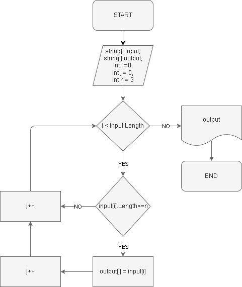

# Итоговоя проверочная работа #
## Задача: ##
Написать программу, которая из имеющегося массива из строк, длинна которохменьше либо равнв 3 символам.
Первоначальный массив можно ввести с клавиатуры, либо задать на старте выполнения аогоритма.

*При решении не рекомендуется пользоваться коллекциями, лучше обойтись исключительно массивами.* 

## Алгоритм решения ##
1. Перебирпем значения исходного массива.
2. Проверяем каждое знаение массва по очереди на соответствие условию: длинна строки меньше или равна трем (3).
3. Если условия выполняются выбранной строкой из исходного массива то данное значение кладем в новый массив.
4. Повторяем пункты 2 и 3 до тех пор пока не достигнем конца исходного массива.
5. Возращаем новый заполненый массив как результат.
## Блок-схема алгоритма ##

## Программа ##

Программа расположена в папке WorkWithMassiv. Для ее запуска неопходимо перейти в соответствующую папку и за пустить программу через терминал : *dotnet run*

После чего программа запросит ввести значения через пробел, нпример: Введите значения через пробел: help son 5 work 42

Пример вывода программы: [help, son, 5, work, 42] -> [son, 5, 42]